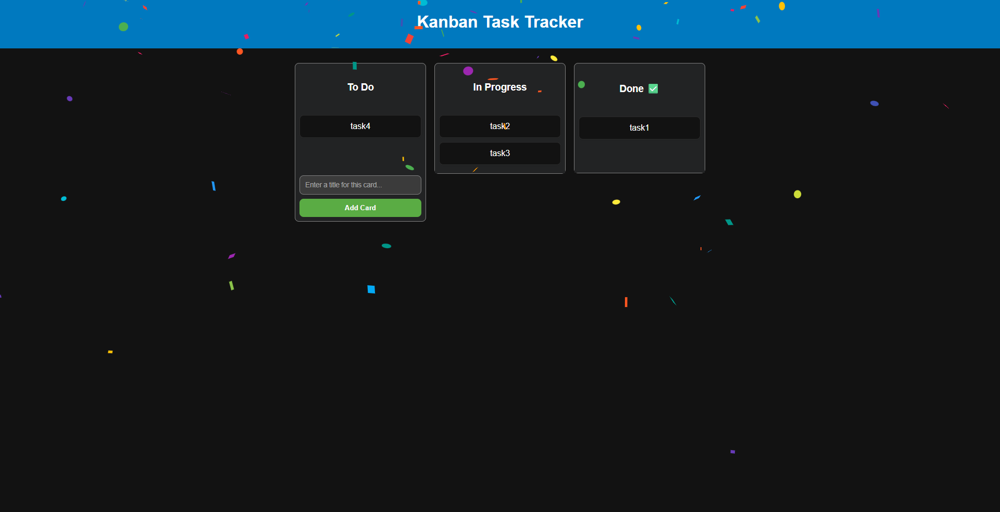

+++
title = "kanaban project"
date = "2025-06-08"
draft = false
pinned = false
image = "/img/kanban-project.png"
+++
# From Scratch: Building an Interactive Kanban Board with React

In this tutorial, I'll walk you through the process of building a beautiful and functional Kanban-style task management application from the ground up using React. This project is a fantastic way to understand core React concepts like state management, components, and handling user interactions.

We'll build a board with columns for "To Do", "In Progress", and "Done". The key feature will be the ability to drag and drop tasks smoothly between columns. We'll also add features to create and delete tasks, and to make it fun and rewarding, we'll include a celebratory confetti effect whenever a task is completed!

Here's a look at the final product we'll be building:


*(To make this image work, make sure the screenshot `kanban-project.png` is in the same folder as this markdown file.)*

### Technologies We'll Use

* **React:** For building our component-based user interface.
* **Styled-components:** For co-locating our styles with our components, keeping our code clean and maintainable.
* **@hello-pangea/dnd:** A powerful and accessible library for all of our drag-and-drop functionality.
* **React-confetti:** A simple and fun library for our task completion celebration.

By the end of this post, you'll have a solid understanding of how these pieces fit together and a great new project for your own portfolio. Let's get started!

---

## Part 1: Project Setup & Data Structure

Before we write a single line of component code, it's crucial to set up our project correctly and think about how we're going to structure the data for our board.

### Setting Up Our React Environment

First, let's create a new React project and install the libraries we'll need. Open your terminal and run these commands one by one:

```bash
# 1. Create a new React application
npx create-react-app kanban-board

# 2. Navigate into your new project folder
cd kanban-board

# 3. Install the libraries for styling, drag-and-drop, and confetti
npm install styled-components @hello-pangea/dnd react-confetti
```

Now that our project is ready, let's define the blueprint for our data.

### The Blueprint: Structuring Our Data

A well-structured application starts with well-structured data. For our Kanban board, we need to keep track of three key things: the tasks themselves, the columns they live in, and the order of those columns.

We'll create a file to hold this initial structure. Inside the `src/` folder, create a new folder named `data`, and inside it, a file named `initial-data.js`.

**File: `src/data/initial-data.js`**

```javascript
// This is the starting data for our application.
// We're starting with an empty board.
const initialData = {
  // The 'tasks' object will store all of our individual tasks.
  // Each task will have a unique ID as its key.
  // Example: tasks: { 'task-1': { id: 'task-1', content: '...' } }
  tasks: {},

  // The 'columns' object will store our three columns.
  columns: {
    'column-1': {
      id: 'column-1',
      title: 'To Do',
      // The 'taskIds' array maintains the order of tasks within this column.
      // It will store the IDs of the tasks that belong here.
      taskIds: [],
    },
    'column-2': {
      id: 'column-2',
      title: 'In Progress',
      taskIds: [],
    },
    'column-3': {
      id: 'column-3',
      title: 'Done',
      taskIds: [],
    },
  },
  
  // The 'columnOrder' array is important for maintaining the order
  // of the columns themselves when we render them.
  columnOrder: ['column-1', 'column-2', 'column-3'],
};

// We export the data so other parts of our app can use it.
export default initialData;
```

---

## Part 2: Building the Visual Components

With our data structure planned, we can now build the visual building blocks of our app: the individual task cards and the columns that will hold them.

First, create a new folder `src/components` to keep our components organized.

### The `Task` Component

This component will represent a single draggable task.

**File: `src/components/Task.jsx`**

```jsx
import React from 'react';
import styled from 'styled-components';
import { Draggable } from '@hello-pangea/dnd';

// This is the styled container for our task card.
const Container = styled.div`
  border: 1px solid lightgrey;
  border-radius: 8px;
  padding: 8px;
  margin-bottom: 8px;
  /* We can change the background color when a task is being dragged */
  background-color: ${props => (props.isDragging ? '#e2f7f1' : 'white')};
`;

const Task = ({ task, index }) => {
  return (
    // The Draggable component from the library makes our task movable.
    // It requires a unique draggableId and an index.
    <Draggable draggableId={task.id} index={index}>
      {(provided, snapshot) => (
        <Container
          // These props need to be applied to the component we want to move.
          {...provided.draggableProps}
          {...provided.dragHandleProps}
          ref={provided.innerRef}
          // snapshot.isDragging is a boolean that is true when the item is being dragged.
          isDragging={snapshot.isDragging}
        >
          {task.content}
        </Container>
      )}
    </Draggable>
  );
};

export default Task;
```

### The `Column` Component

This component will render a column and all the tasks inside it.

**File: `src/components/Column.jsx`**

```jsx
import React from 'react';
import styled from 'styled-components';
import { Droppable } from '@hello-pangea/dnd';
import Task from './Task';

const Container = styled.div`
  margin: 8px;
  border: 1px solid lightgrey;
  border-radius: 8px;
  width: 220px;
  display: flex;
  flex-direction: column;
`;
const Title = styled.h3`
  padding: 8px;
`;
// TaskList will be the area where tasks can be dropped.
const TaskList = styled.div`
  padding: 8px;
  flex-grow: 1;
  min-height: 100px;
  /* Change background color when dragging over */
  background-color: ${props => (props.isDraggingOver ? '#e3f2fd' : 'white')};
`;

const Column = ({ column, tasks }) => {
  return (
    <Container>
      <Title>{column.title}</Title>
      {/* The Droppable component makes this area a valid drop target. */}
      {/* It requires a unique droppableId. */}
      <Droppable droppableId={column.id}>
        {(provided, snapshot) => (
          <TaskList
            ref={provided.innerRef}
            {...provided.droppableProps}
            isDraggingOver={snapshot.isDraggingOver}
          >
            {/* We map over the tasks for this column and render a Task component for each one. */}
            {tasks.map((task, index) => (
              <Task key={task.id} task={task} index={index} />
            ))}
            {/* The placeholder adds space when dragging to a new column. */}
            {provided.placeholder}
          </TaskList>
        )}
      </Droppable>
    </Container>
  );
};

export default Column;
```

---

## Part 3: Implementing Drag-and-Drop

Now we'll wire up the main logic in `App.js` to handle what happens when a user finishes dragging a task.

The `@hello-pangea/dnd` library requires us to wrap our application in a `DragDropContext`. This context provider is what manages the state of our drag-and-drop operations. We also need to give it a function to call when a drag ends, called `onDragEnd`.

**File: `src/App.js` (Initial Logic)**

```jsx
import React, { useState } from 'react';
import styled from 'styled-components';
import { DragDropContext } from '@hello-pangea/dnd';
import initialData from './data/initial-data';
import Column from './components/Column';

const Container = styled.div`
  display: flex;
`;

function App() {
  const [data, setData] = useState(initialData);

  // This function will be called by the library when a drag ends.
  const onDragEnd = result => {
    const { destination, source, draggableId } = result;

    // 1. If the user drops outside of a valid column, do nothing.
    if (!destination) {
      return;
    }

    // 2. If the user drops the item back into its original position, do nothing.
    if (
      destination.droppableId === source.droppableId &&
      destination.index === source.index
    ) {
      return;
    }

    const startColumn = data.columns[source.droppableId];
    const finishColumn = data.columns[destination.droppableId];

    // 3. Logic for reordering tasks within the SAME column.
    if (startColumn === finishColumn) {
      // Create a new array of taskIds from the column's existing taskIds.
      const newTaskIds = Array.from(startColumn.taskIds);
      // Remove the taskId from its old position in the array.
      newTaskIds.splice(source.index, 1);
      // Insert the taskId into its new position.
      newTaskIds.splice(destination.index, 0, draggableId);

      // Create a new column object with the updated taskIds array.
      const newColumn = {
        ...startColumn,
        taskIds: newTaskIds,
      };

      // Create a new state object for our application.
      const newState = {
        ...data,
        columns: {
          ...data.columns,
          [newColumn.id]: newColumn,
        },
      };

      // Update the state.
      setData(newState);
      return; // Stop the function here.
    }

    // 4. Logic for moving a task from one column to another.
    // Create a new array for the starting column's taskIds.
    const startTaskIds = Array.from(startColumn.taskIds);
    // Remove the dragged taskId from the starting column.
    startTaskIds.splice(source.index, 1);
    const newStart = {
      ...startColumn,
      taskIds: startTaskIds,
    };

    // Create a new array for the finishing column's taskIds.
    const finishTaskIds = Array.from(finishColumn.taskIds);
    // Insert the dragged taskId into the finishing column.
    finishTaskIds.splice(destination.index, 0, draggableId);
    const newFinish = {
      ...finishColumn,
      taskIds: finishTaskIds,
    };

    // Create the new state with updated start and finish columns.
    const newState = {
      ...data,
      columns: {
        ...data.columns,
        [newStart.id]: newStart,
        [newFinish.id]: newFinish,
      },
    };
    setData(newState);
  };

  return (
    // Wrap the draggable part of our app in the DragDropContext
    <DragDropContext onDragEnd={onDragEnd}>
      <Container>
        {data.columnOrder.map(columnId => {
          const column = data.columns[columnId];
          const tasks = column.taskIds.map(taskId => data.tasks[taskId]);

          return <Column key={column.id} column={column} tasks={tasks} />;
        })}
      </Container>
    </DragDropContext>
  );
}

export default App;
```

---

## Part 4: Adding Features & Polish

Our app is functional, but let's add the ability to add and delete tasks, and the fun confetti effect.

### Adding New Tasks

We'll create a new `AddTaskForm.jsx` component and wire it up in `App.js`.

**File: `src/components/AddTaskForm.jsx`**
```jsx
import React, { useState } from 'react';
import styled from 'styled-components';

const FormContainer = styled.form`
  padding: 8px;
`;
const StyledInput = styled.input`
  width: 100%;
  padding: 8px;
  box-sizing: border-box;
`;
const StyledButton = styled.button`
  width: 100%;
  margin-top: 4px;
  padding: 8px;
`;

const AddTaskForm = ({ onAddTask, columnId }) => {
  const [content, setContent] = useState('');

  const handleSubmit = (e) => {
    e.preventDefault();
    if (!content.trim()) return; // Don't add empty tasks
    onAddTask(content, columnId);
    setContent(''); // Reset form
  };

  return (
    <FormContainer onSubmit={handleSubmit}>
      <StyledInput
        type="text"
        value={content}
        onChange={(e) => setContent(e.target.value)}
        placeholder="Add a new task..."
      />
      <StyledButton type="submit">Add Task</StyledButton>
    </FormContainer>
  );
};

export default AddTaskForm;
```

We then need to update `Column.jsx` to show this form and `App.js` to handle the logic. The logic will involve creating a new task, adding it to our `data.tasks` object, and adding its ID to the correct column's `taskIds` array.

### Deleting Tasks

To delete a task, we can add a small delete button to our `Task.jsx` component. When clicked, it will call a `handleDeleteTask` function in `App.js`. This function will do the reverse of adding a task: it will remove the task from the `data.tasks` object and its ID from the column's `taskIds` array.

### The Confetti Effect

Using the `react-confetti` library is straightforward. We can add a state variable like `const [showConfetti, setShowConfetti] = useState(false)`. In our `onDragEnd` logic, if a task is moved to the "Done" column, we set `showConfetti` to `true`. We then use a `setTimeout` to set it back to `false` after a few seconds. In our JSX, we conditionally render the `<Confetti />` component when `showConfetti` is true.

---

## Part 5: The Final `App.js`

After adding all the features, our main `App.js` file will manage all the state and logic. Here is the complete, final version.

**File: `src/App.js` (Final Version)**
```jsx
import React, { useState, useEffect } from 'react';
import styled from 'styled-components';
import { DragDropContext } from '@hello-pangea/dnd';
import Confetti from 'react-confetti';
import initialData from './data/initial-data';
import Column from './components/Column';
// We also need to remember to import the AddTaskForm to use it.
// We would also update Column.jsx to show it.

const Container = styled.div`
  display: flex;
  justify-content: center;
  padding: 20px;
`;

function App() {
  const [data, setData] = useState(initialData);
  const [showConfetti, setShowConfetti] = useState(false);

  // We'll skip the add/delete functions here for brevity, 
  // but this is where they would live. They would update the 'data' state.

  const onDragEnd = result => {
    const { destination, source, draggableId } = result;

    if (!destination) return;
    if (
      destination.droppableId === source.droppableId &&
      destination.index === source.index
    ) return;

    const startColumn = data.columns[source.droppableId];
    const finishColumn = data.columns[destination.droppableId];

    // Trigger confetti if task is moved to the 'Done' column
    if (finishColumn.id === 'column-3') {
      setShowConfetti(true);
      setTimeout(() => setShowConfetti(false), 5000); // Confetti for 5 seconds
    }
    
    // All the reordering and moving logic from before remains the same...
    if (startColumn === finishColumn) {
      const newTaskIds = Array.from(startColumn.taskIds);
      newTaskIds.splice(source.index, 1);
      newTaskIds.splice(destination.index, 0, draggableId);
      const newColumn = { ...startColumn, taskIds: newTaskIds };
      const newState = { ...data, columns: { ...data.columns, [newColumn.id]: newColumn }};
      setData(newState);
      return;
    }

    const startTaskIds = Array.from(startColumn.taskIds);
    startTaskIds.splice(source.index, 1);
    const newStart = { ...startColumn, taskIds: startTaskIds };
    const finishTaskIds = Array.from(finishColumn.taskIds);
    finishTaskIds.splice(destination.index, 0, draggableId);
    const newFinish = { ...finishColumn, taskIds: finishTaskIds };
    const newState = { ...data, columns: { ...data.columns, [newStart.id]: newStart, [newFinish.id]: newFinish }};
    setData(newState);
  };

  return (
    <>
      {/* Conditionally render the Confetti component */}
      {showConfetti && <Confetti />}
      <DragDropContext onDragEnd={onDragEnd}>
        <Container>
          {data.columnOrder.map(columnId => {
            const column = data.columns[columnId];
            const tasks = column.taskIds.map(taskId => data.tasks[taskId]);

            // We would pass the add/delete functions as props to the Column here
            return <Column key={column.id} column={column} tasks={tasks} />;
          })}
        </Container>
      </DragDropContext>
    </>
  );
}

export default App;
```

## Conclusion

And there you have it! A complete, interactive Kanban board built from scratch. We've learned how to structure data, build reusable React components, and implement complex features like drag-and-drop. From here, you can continue to build on this foundation by adding features like editing tasks, persisting data to a backend, or user authentication.

Thanks for building along with me!